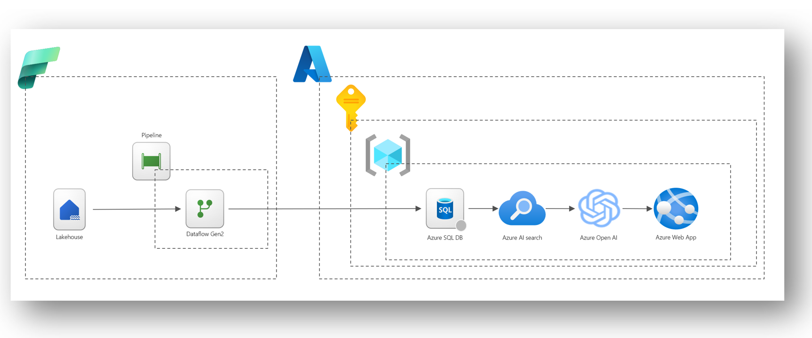

# Version Française

Dans cette section, nous allons implémeter une solution pour transformer les données venant de Microsoft Fabric OneLake, pour les consommer avec le service Azure OpenAI.

Ci-dessous, un aperçu de la solution :

Les étapes de l'implémentation sont détaillées [ici en Français](/Fabric/Fabric%20+%20Azure%20Open%20AI/Docs/README_Fr.md) 

# English version

In this section, we'll provide a solution to transform data from Microsoft Fabric OneLake to consume with the Azure OpenAI service.

Below is an overview of the solution:

The implementation steps are detailed [here in English](/Fabric/Fabric%20+%20Azure%20Open%20AI/Docs/README_Us.md)