# Microsoft Fabric + Azure Open AI

## Prerequisites

- An Azure [subscription](https://azure.microsoft.com/en-ca/free/) with the following services:
  - [Azure SQL database](https://learn.microsoft.com/en-us/azure/azure-sql/database/sql-database-paas-overview?view=azuresql). **WARNING!** The database must already be created. 
    - Follow [How to create an Azure SQL DB database](https://learn.microsoft.com/en-us/azure/azure-sql/database/single-database-create-quickstart?view=azuresql&tabs=azure-portal) 
  - [Azure AI Search](https://learn.microsoft.com/en-us/azure/search/search-what-is-azure-search)
    - If you want to use semantic ranking, you need to configure at least one service with a basic or standard tier (S1, S2, S3) 
    - **ATTENTION!!** It is not possible to change tiers after the service has been deployed
    - If you want to add artificial intelligence enrichments, it is possible to use Azure cognitive services. You can create an Azure AI service by following this [link](https://learn.microsoft.com/en-us/azure/ai-services/multi-service-resource?tabs=windows&pivots=azportal). (I'm going to use an existing service later in this article).
    -  **WARNING!!** At the time of writing this article, column names with spaces were not supported (so I had to rename some columns).
  - [Azure Open AI](https://learn.microsoft.com/en-us/azure/ai-services/openai/overview)
- A [Microsoft Fabric](https://learn.microsoft.com/en-us/fabric/enterprise/buy-subscription) capability
  - A workspace associated with Microsoft Fabric capability. [Documentation](https://learn.microsoft.com/en-us/fabric/get-started/workspaces#license-mode)

## Overview

In this article, we'll look at how to prepare data in a lakehouse and then work with Azure Open AI.
Below is an overview of the architecture we will be implementing:

The files for this article can be found here on my Github repo [here](/Data/). 

These files are then stored in the "File" part of my Lakehouse.

## Creation of the Dataflow

Make sure you're under the "Data Engineering" persona. Then, from a workspace associated with a Fabric capacity, click on the "New" button and select "dataflow Gen2":

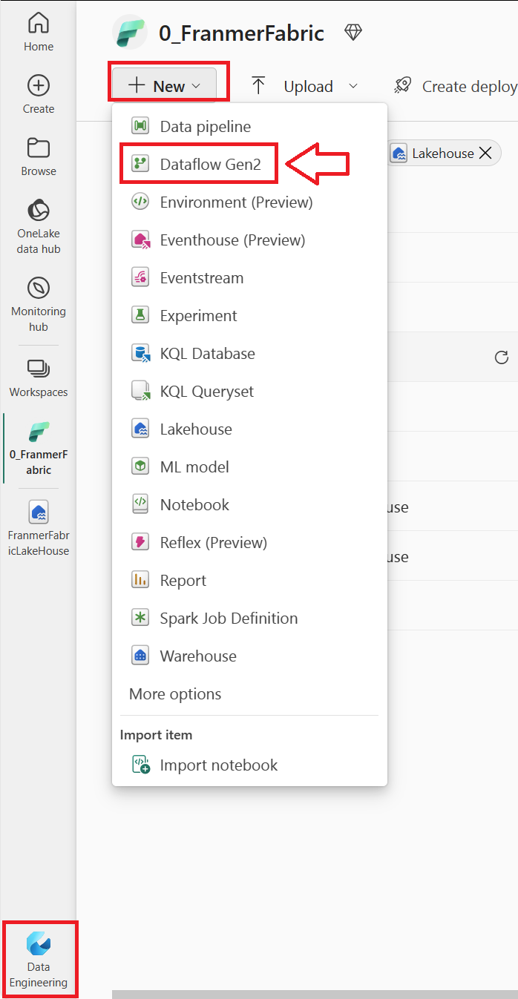

From the Dataflow Gen2 interface, click on "Get Data" and then click on "More":

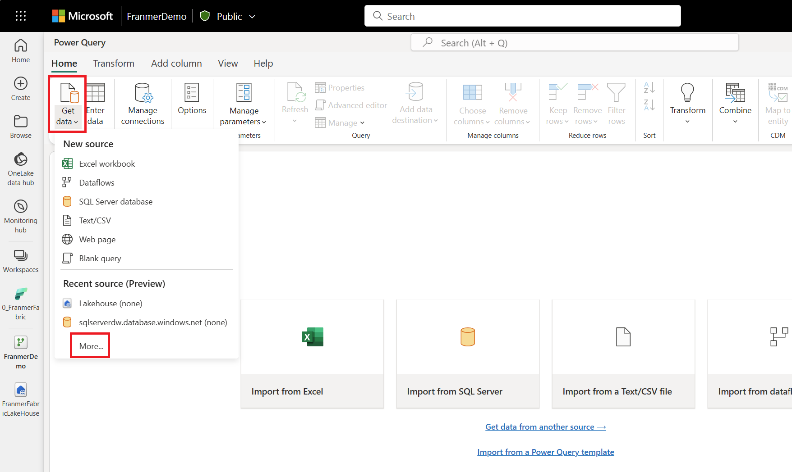

In the "New sources" section, click on "View more":

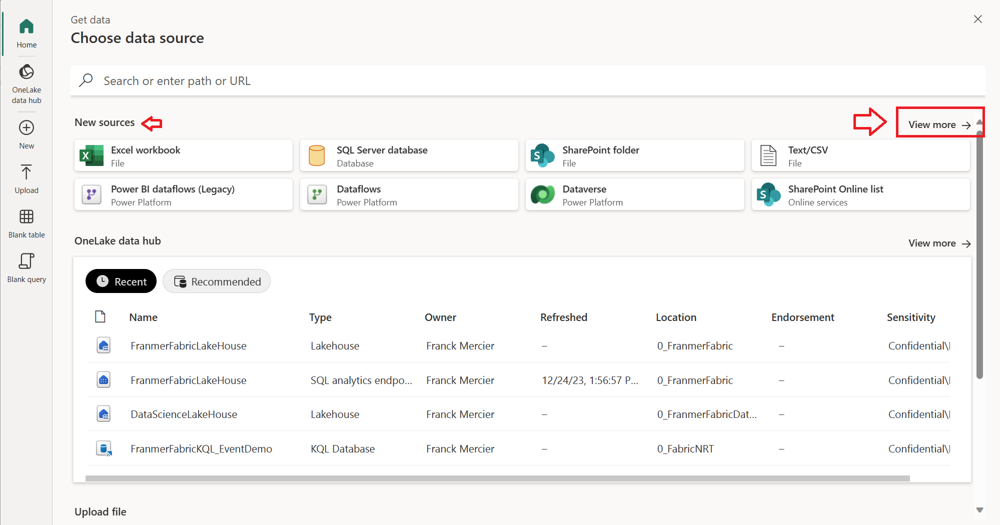

Click on "Microsoft Fabric" and then on "Lakehouse":

Set the connection on your Lakehouse and click "Next":

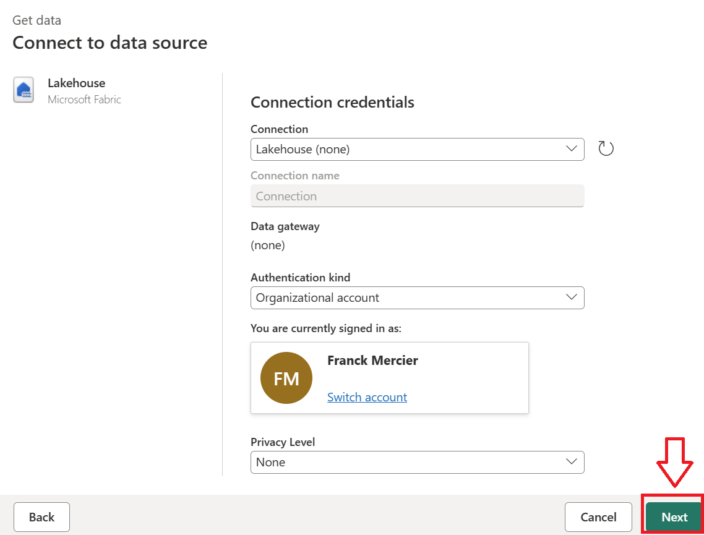

Select the files. In this example, I'm selecting files stored in the "File" section of my lakehouse. Once you have made your selection, click on "Create":

### Initial Data Cleansing

You should end up with an interface similar to the one below. It may be necessary to perform transformations at the file level before merging the files together.

For example, at the "product.csv" file level, we notice that the first row appears to be the column header. So we're going to use the "Use first row as headers" transformation to reflect the reality of the file:

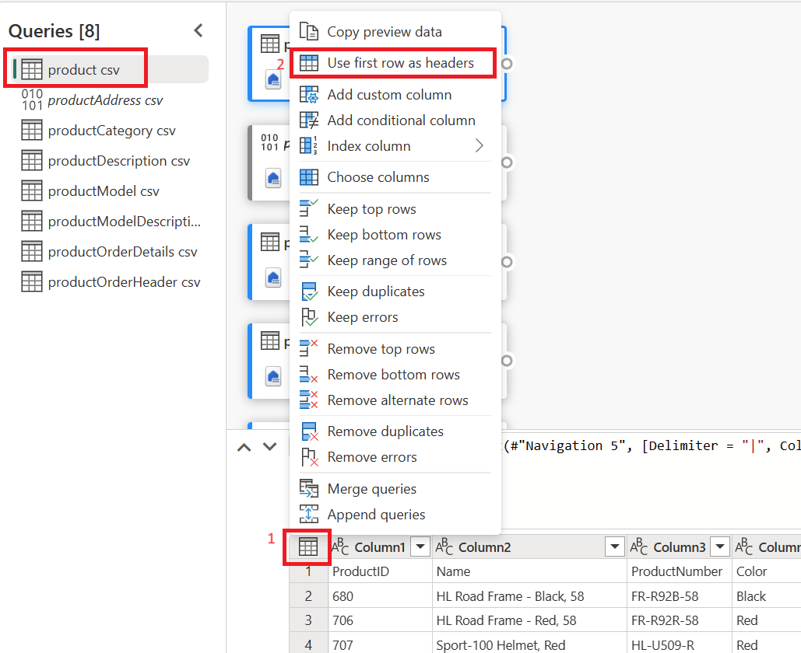

You should get a result similar to the one below. Do the same with the other files if needed.

In our example, the file "productAddress.csv" appears to have been incorrectly processed. Indeed, it seems to be seen as a binary file and not as a csv file. On closer inspection, it seems to be a problem with the separator used by Microsoft Fabric Dataflow Gen2 during the initial transformation.

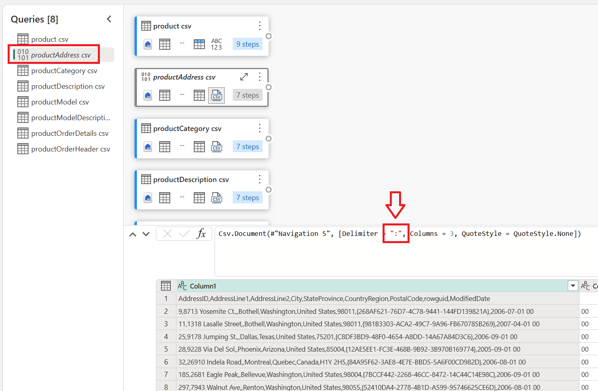

Directly from the interface, **change the delimiter ":" to ","**. Also change the number of columns you want to keep. Here I put 9, because I want to keep all the columns for now.

Then make the necessary transformations to improve the quality of the data (such as adding the first row as the column header 😉)

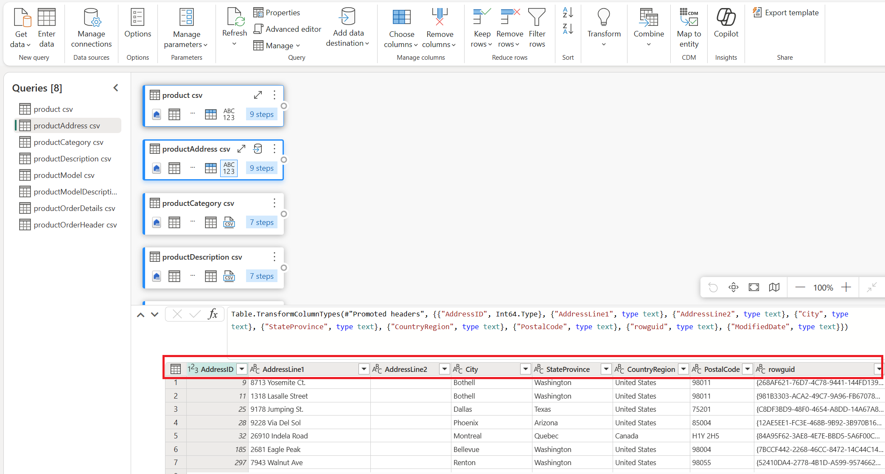

Once all the files are of good quality, we can start creating transformations to create the view with the information needed to populate our future database. As a reminder, this database will serve as a data source for our Azure AI Search service that will feed the Azure Open AI service.

The next steps will be data merge steps in order to arrive at our final view.

### Merging Queries

Click on the 3 dots at the top right of the query box. Then click on "Merge queries as new":

Select the file you want to merge with. In this example, I will take the file "productCategory.csv". In addition, I decide to do an "Inner" join to make sure I have the corresponding data coming from the 2 files.

Click on the "Ok" button:

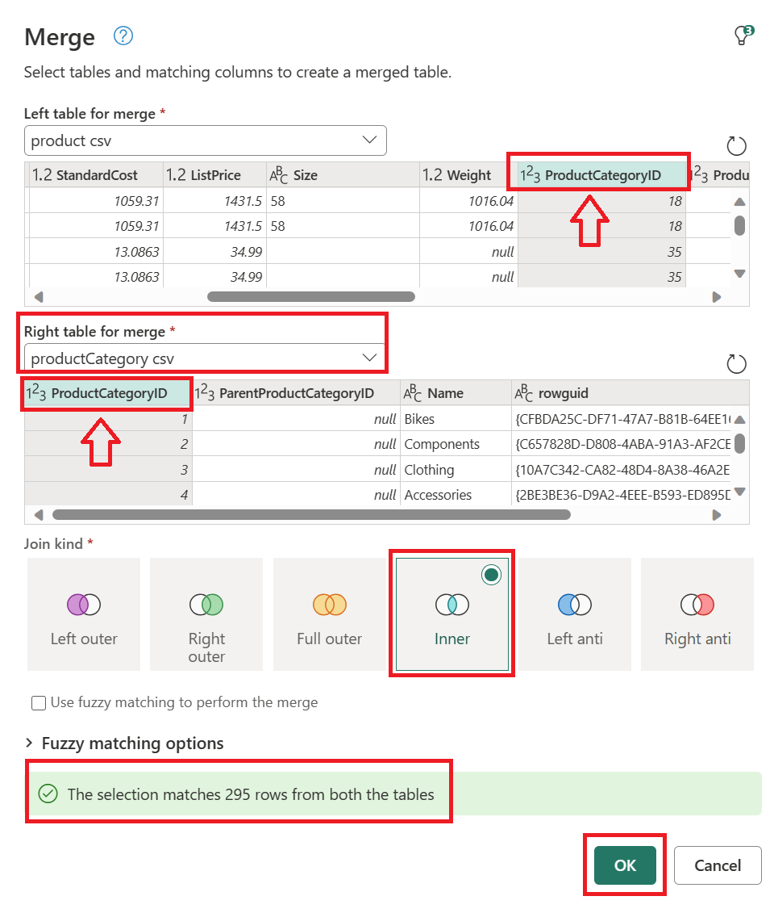

The data is merged. However, you need to select the columns on the right-hand side that you want to keep. To do this, move the scroll bar to the right until you reach the column with the name of your file. In my case, the column is named **"productCategory csv"**.

Click the arrows to select the columns you want to keep. Check the boxes for the columns you want to keep and then click "Ok"

Don't forget to rename the columns so that you have a dataset that can be understood by business users. **ATTENTION!!! As a reminder, Azure AI Search doesn't support column names with spaces!**

Repeat the merge, cleanup, and rename process to get a view with the relevant information you want to deliver to your business users.

**ATTENTION!!!**. For some merge queries, choose the type of join. For example, with the "productOrderDetails csv" file, it's best to use a "Right outer" join (if the file is to the right of the join, of course). A good way to check if you are retrieving the correct number of rows is to check the number of rows returned at the bottom of the merge window.

Here's the overview of my Dataflow Gen2:

### Define the destination of the Dataflow

One of the major new features of Dataflow Gen2 is the ability for each query to define, if necessary, a destination. And it opens the door to many scenarios, such as integrating Microsoft Fabric data with Azure Open AI!

Click on your final query (it is possible to do this for all queries in your Dataflow), then click on the **"Add data destination"** button. There are several options available to you. In our example, we'll choose "Azure SQL Database".

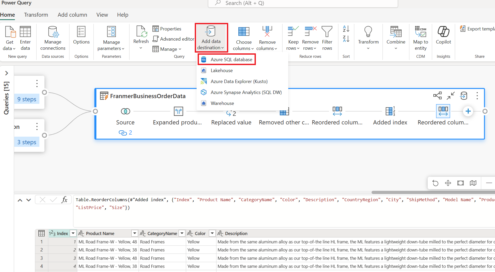

Fill in the login information for your Azure SQL Database. Click "Next":

Give your table a name and click "Next":

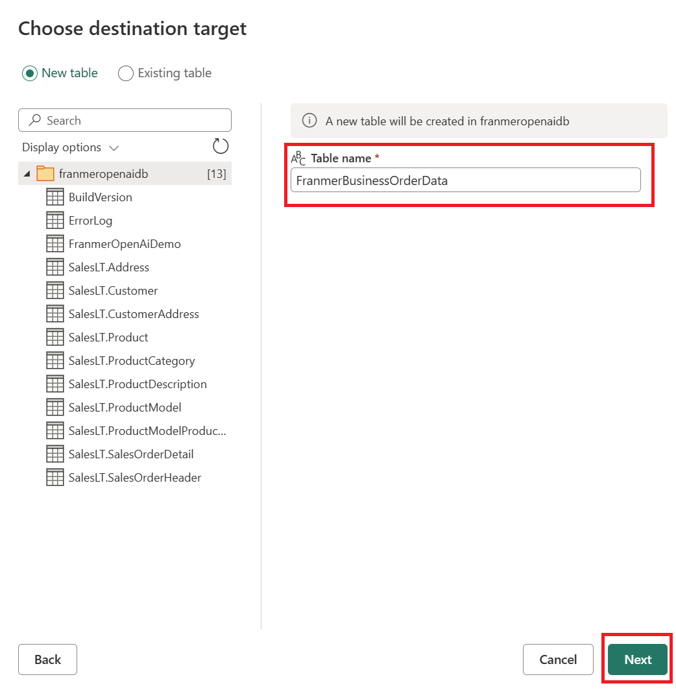

Next, set the update methods. In the case of this example, I'm keeping the "Replace" option. Click on "Save settings":

Once all these steps are complete, click the "Publish" button to run the transformations and create a new table in our Azure SQL Database.

The whole process should take a few minutes. It is possible to check the status of the Dataflow update from the workspace:

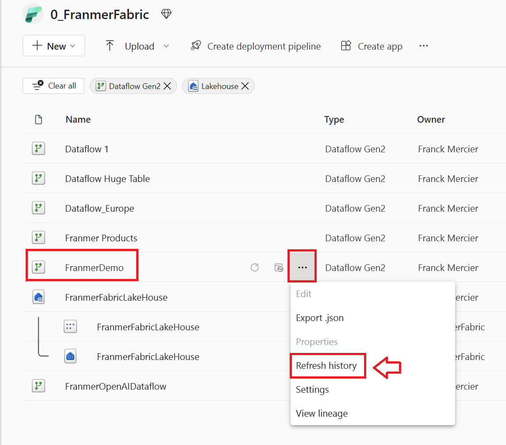

If all goes well 😊:

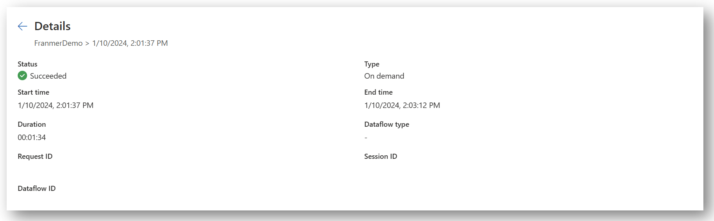

From the [Azure portal](https://portal.azure.com/), connect to your Azure SQL DB server to verify that the table has been created in your Azure SQL DB database:

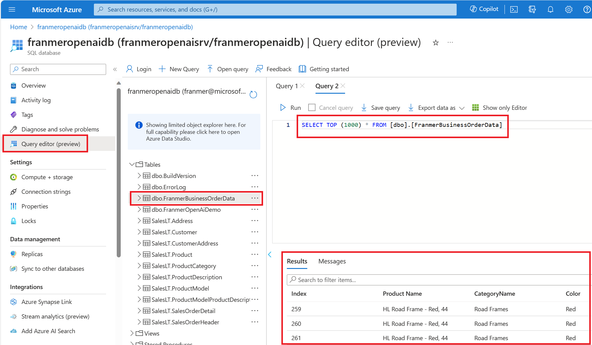

# Azure AI Search

Now that we have a table with the data we want, we'll use it to prepare an index that will then be used by the Azure Open AI service.

## Creating a Resource Group

You can create a resource group to group the resources that you are going to create. In my case, the Azure SQL Database is in a different resource group, but in the same subscription.

From the [Azure portal](https://portal.azure.com/), click the "Create a resource" button.

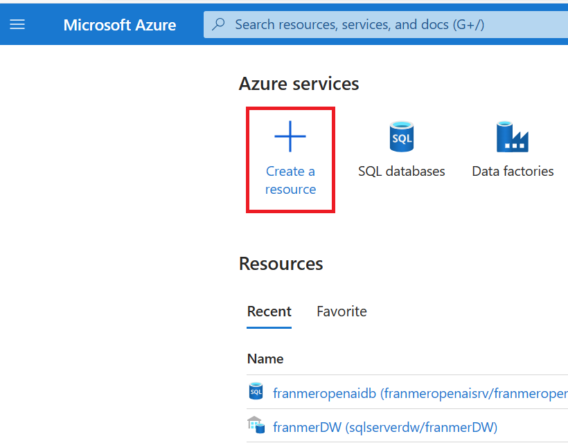

Then search for "Resource group".

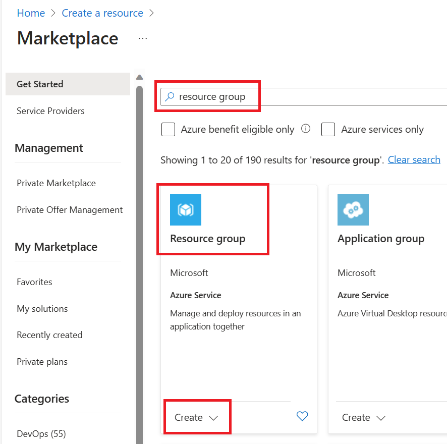

Fill in the information then click on "Review + create" and validate the creation of the resource group by clicking on the "Create" button.

Once the resource group is created, go to it by clicking on the "Go to resource group" button.

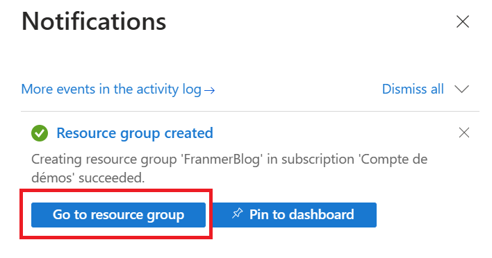

## Creating the Azure AI Search service

In this section, we'll do the following steps:
- Creating a data source
- Creating an index
- Creating an indexer

From the resource group you created earlier, click on the "Create" button

Then search for the Azure AI Search service.

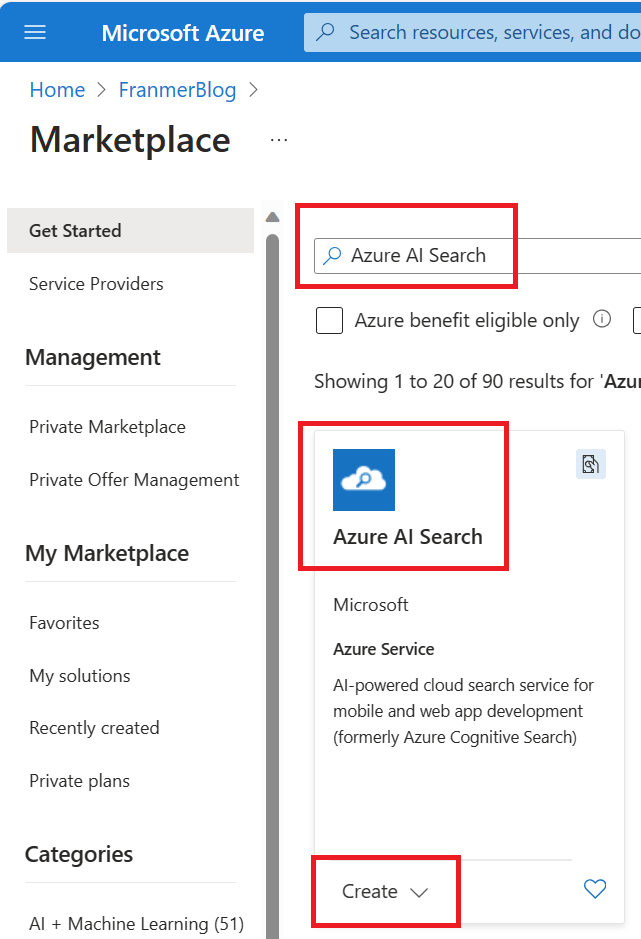

Fill in the information and create the service.

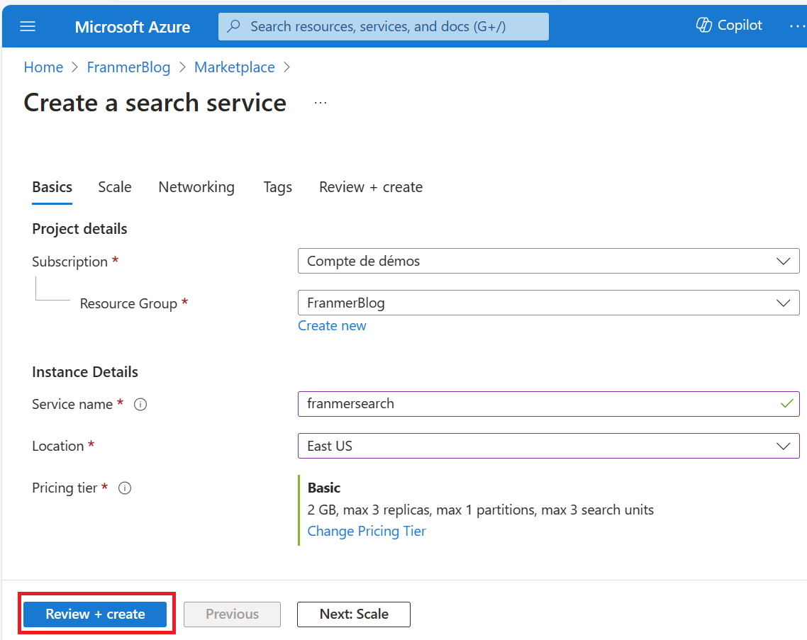

Once the service is created, click on the "Go to resource" button.

#### Data source

**ATTENTION!!!** At the time of writing this article, column names with spaces were not supported (so I had to rename some columns).

Once on the  **"Overview"** page  of the Azure AI search service, click on  **"Import data"**

Select the data source. Here we're going to choose Azure SQL Database.

Fill in the login details. The **"Choose an existing connection"** link allows you to quickly find the connection string to our Azure SQL database.

**Optionally**, it is possible to enrich the index using Azure cognitive services, based on the documents in the data source. It is possible to test this feature for free but in a limited way. It's also possible to use your own Azure AI service for more features. More information on enrichment features can be found by following [this link](https://learn.microsoft.com/en-us/azure/search/cognitive-search-concept-intro).

It's also possible to use the Knowledge Store to preserve content generated by Azure AI services for non-search scenarios (such as Power BI reporting). More information [here](https://learn.microsoft.com/en-us/azure/search/knowledge-store-concept-intro?tabs=portal).

In this example, I'm using a service that I deployed beforehand. Then I chose the following options for the  **"Description"** field ("Source Data Field"):

- "Extract key phrases"
- "Detect Language"
- "Translate Text"

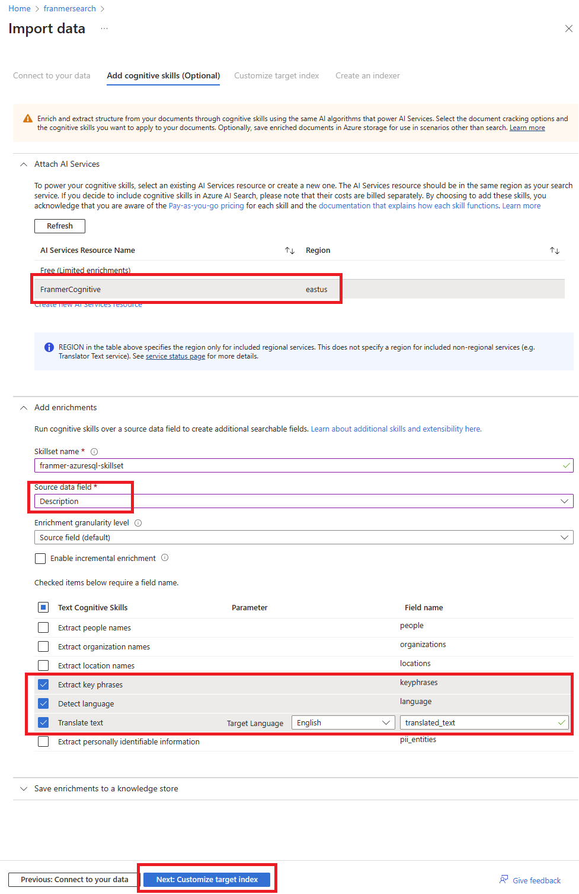

Click on "Next: Customize target index"

#### Creating the index

Now we're going to configure the index. To do this, it is important to keep in mind the following definitions:

-  **Retrievable**: Fields returned in a query response.
-  **Filterable**: Fields that accept a filter expression.
-  **Out of the box: fields that accept an "OrderBy" expression.
-  **Facetable**: Fields used in a faceted navigation structure.
- **Searchable**: Fields used in full-text search. Strings can be used in a search. Numeric and Boolean fields are often marked as unsearchable.

In addition, the "Key" field must be defined. It is a "string" field that uniquely represents each document.

More information [available here](https://learn.microsoft.com/en-us/azure/search/search-get-started-portal#configure-the-index).

Once the index is configured, click "Next: Create an indexer".

#### Creating the Indexer

The last step configures and runs the indexer. This object defines an executable process. The data source, index, and indexer are created in this step.

Give your index a name, set the execution schedule (for this example I chose "Once"), and then click "Submit".

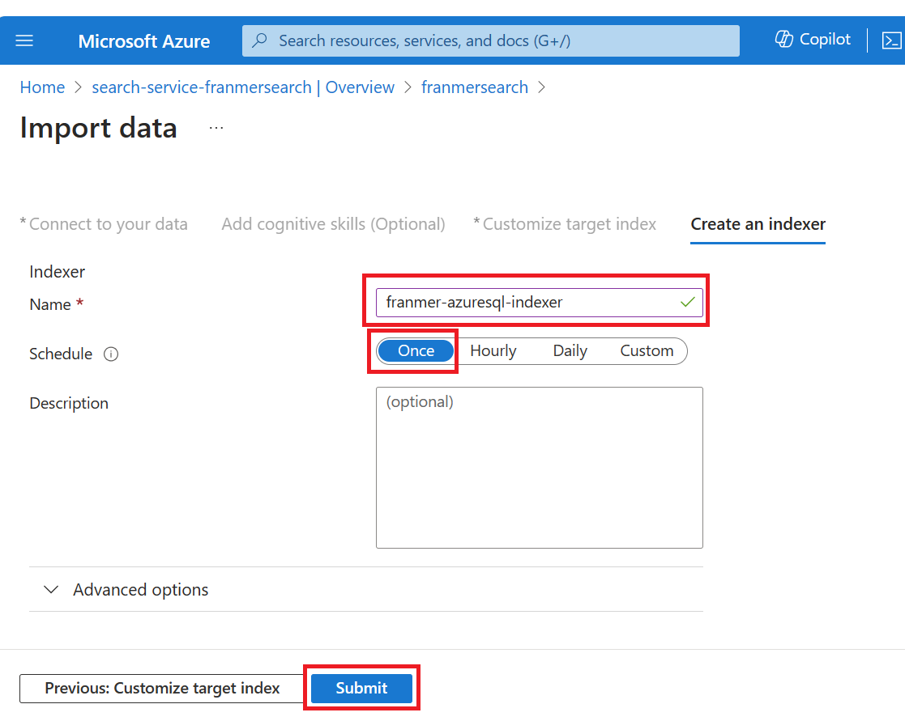

To monitor the proper execution of the indexer, you can go to the "Index" menu and check the progress.

If all goes well 😊:

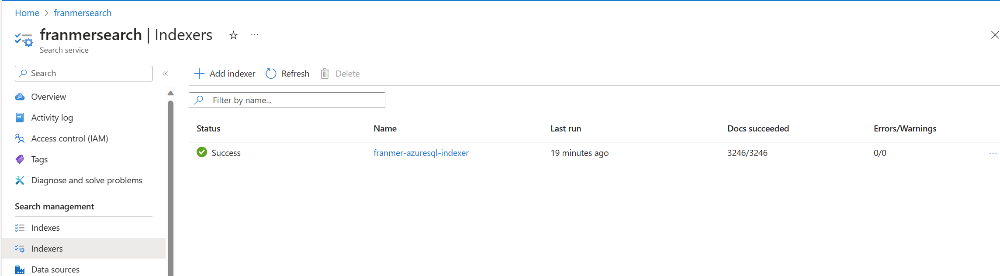

#### Checking the index

To check the relevance of the index, go to the "Indexes" menu, then click on the name of your index.

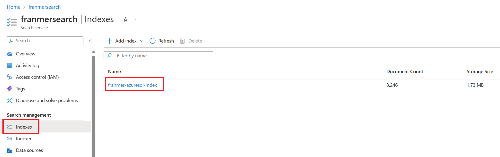

In the "Search explorer" tab, in the "Search" field, enter the character "*", then click the **"Search" button. You can now check the returns from the index:

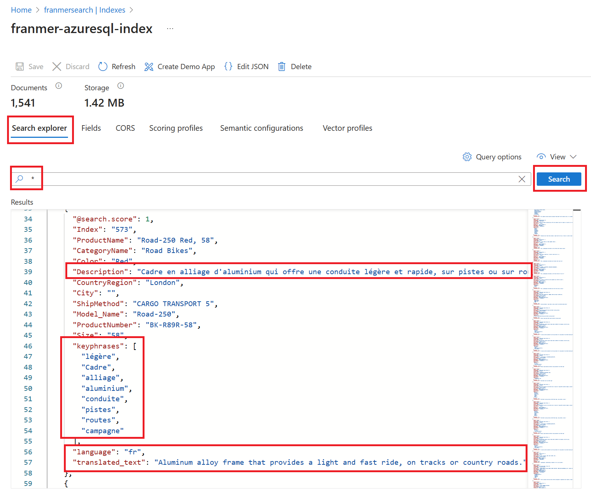

# Azure Open AI

Now that our index is set up, we're going to use it with the Azure Open AI service.

## Creating the Azure Open AI service

From the previously created resource group, click "Create".

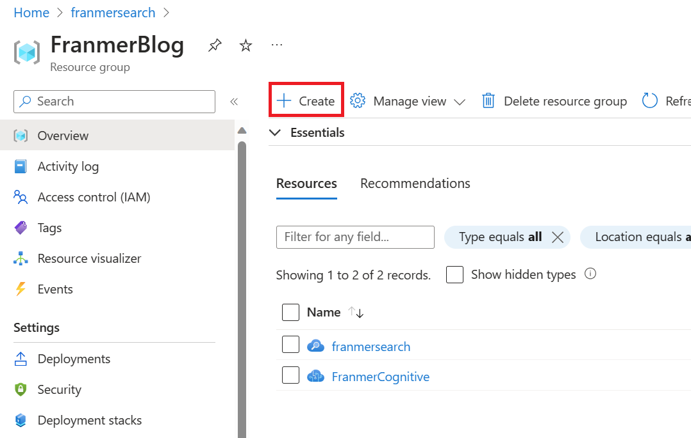

Search for the "Azure OpenAI" service and click "Create".

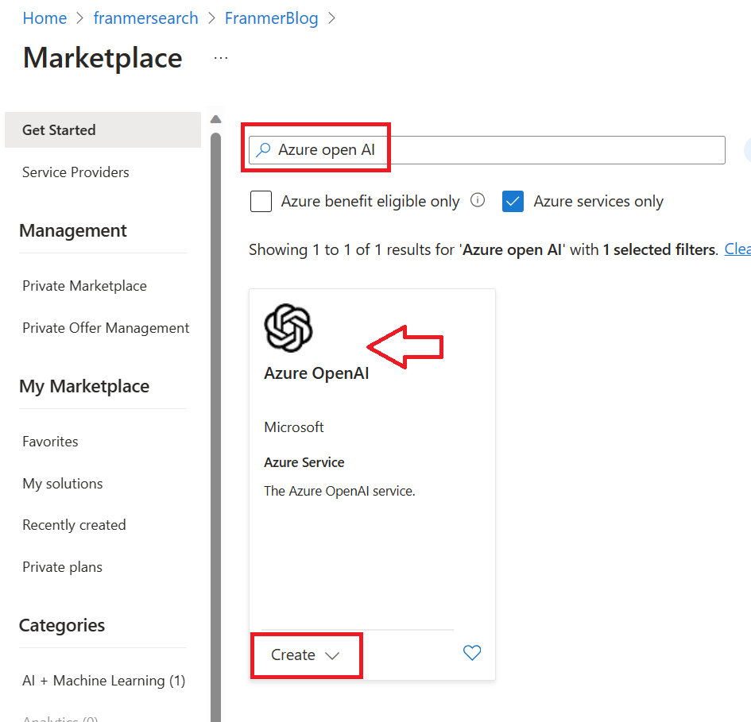

To choose the region of the service, look at this [site](https://learn.microsoft.com/en-us/azure/ai-services/openai/quotas-limits#regional-quota-limits)

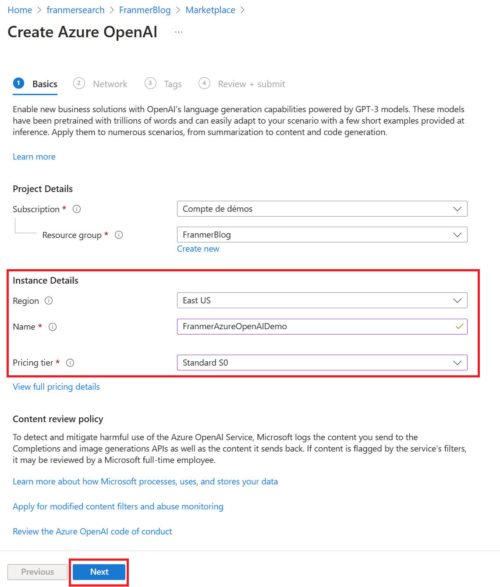

For this demonstration, I've selected "All network".

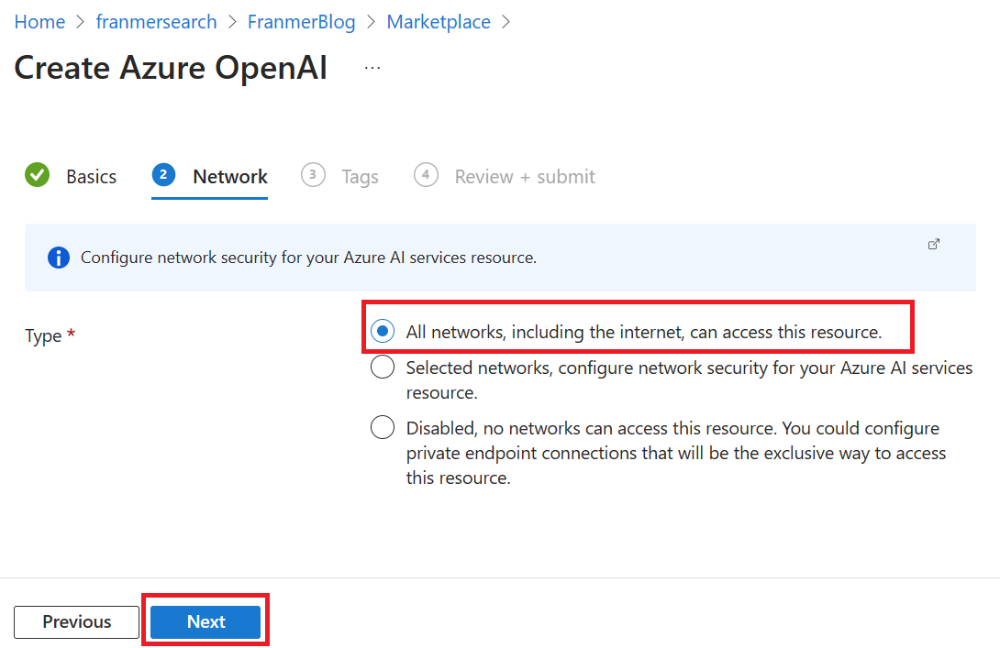

Review your deployment options and click "Create".

Once the service is deployed, click on the "Go to resource" button.

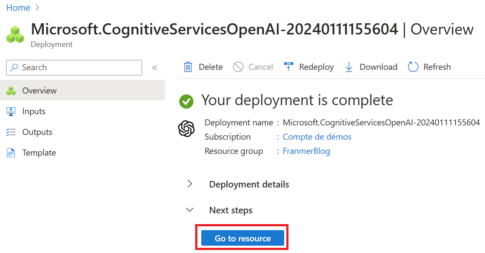

## Azure Open AI Studio

From the Azure OpenAI service, in the "Overview" menu, click "Go to Azure OpenAI Studio".

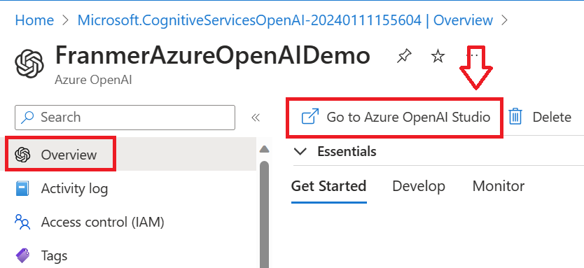

Before you begin, create at least one deployment. On the left, click on "Deployments" and then on "Create new deployment".

Once in the studio, click on the "Bring your own data" tile.

Since the service has just been created, no deployment is present yet. Click on the "Create new deployment" button:

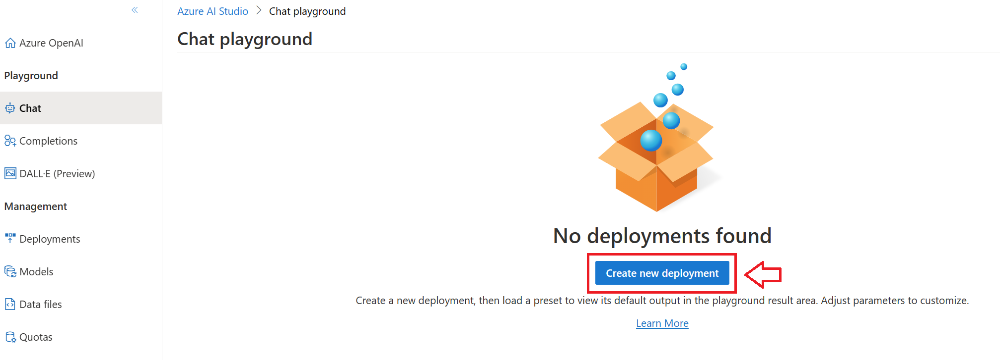

A wizard will guide you through defining your first model deployment. Here we will deploy the **"gpt-35-turbo"** model. Click on the "Create" button:

The "Chat playground" window is now available. We're going to use that to add our data to it. Click  on **"Add your data"**  and then on the **"Add a data source"** button.

From the "Select data source" drop-down list, choose "Azure AI Search". Then fill in the information about the index you created earlier. Click on the "Next" button.

Since we're using our own index, we're going to define the fields we want to use to answer the questions. It is possible to provide multiple fields for the "Content Data" field. It is necessary to include all fields that have text related to our use case.

Below, here's how I set up the field mapping:

As we have configured our index to support semantic search, in the "Search Type" drop-down list, we can choose "Semantic". Then select the index you want to use.

Click on "Save and close".

You're ready to engage with your data. Ask your questions in the "Chat session" section.

Below is an example of a conversation. Note that the answers are accompanied by references.

In addition, it is possible to change the language during the discussion. In the example below, I start the conversation in English and then continue in French!

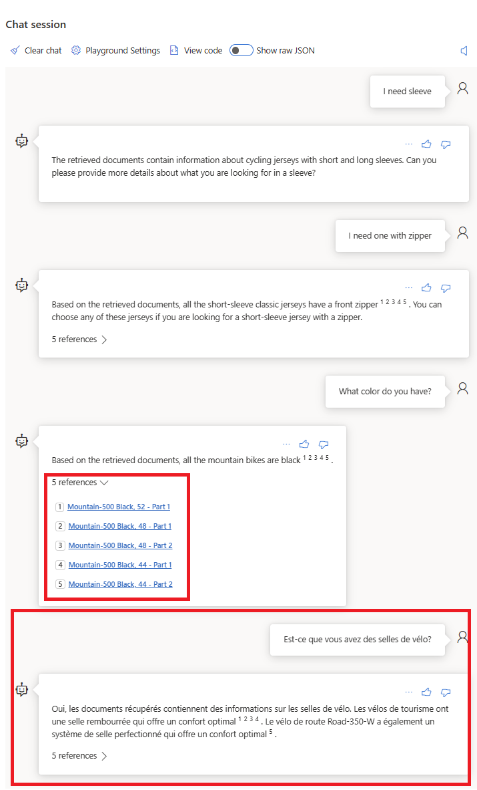

### Good to know
In the "Index data field mapping" step, it is possible to define an index field for "File Name" as well as for "Title":

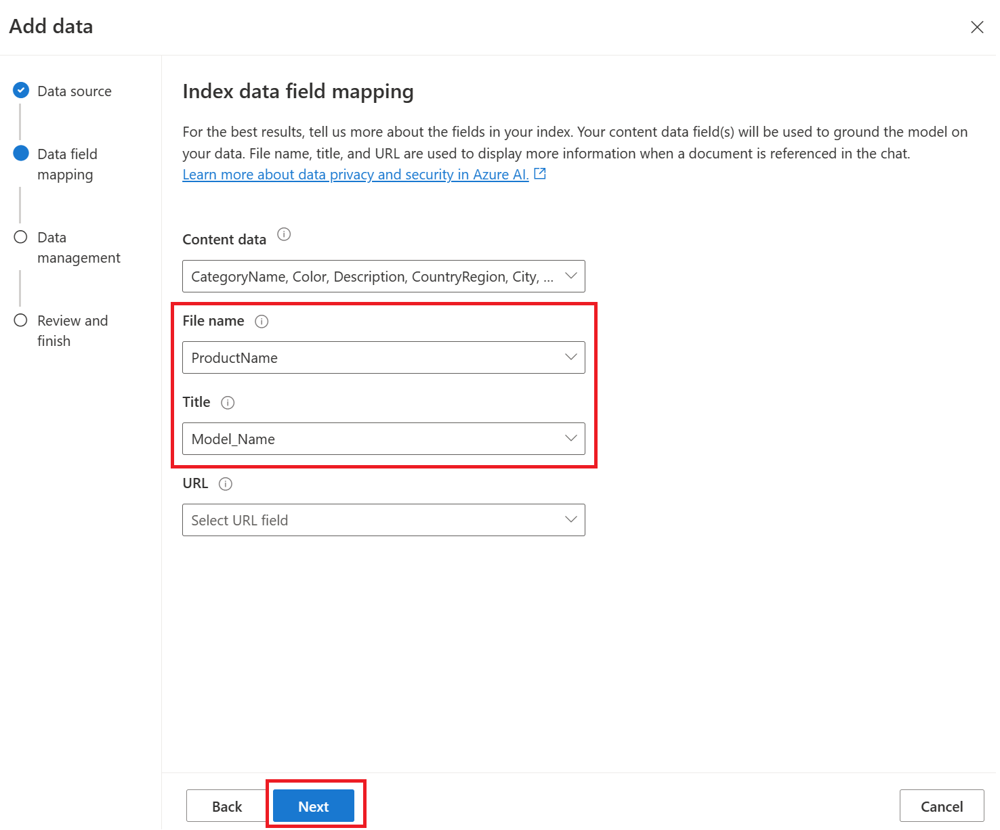

This allows you to add information for the references as shown below:

## Deployment in a web application

Once your configuration has been validated, it can be deployed in:

- A "Web App"
- A "Power Virtual Agent Bot"

For this article, we're going to deploy in a web app. Click on "A new web app..."

The "Deploy to a web app" wizard appears. Fill in the information and click "Deploy".
(It is also possible to keep the chat history by checking the "Enable chat history in the web app" box.)

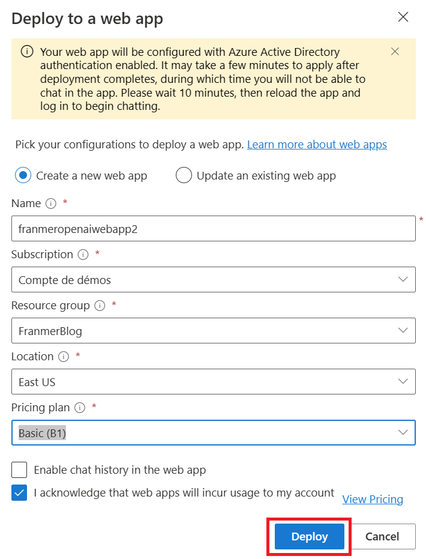

After about ten minutes, you will have a web application with your chat application.

You can follow the progress of the deployment of your web app by clicking on the notifications icon.

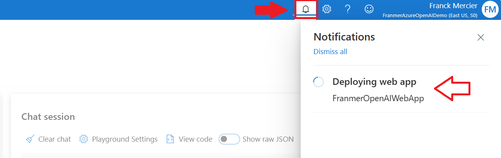

Once your web app is deployed, you can directly use it as an independent application with your own data.

